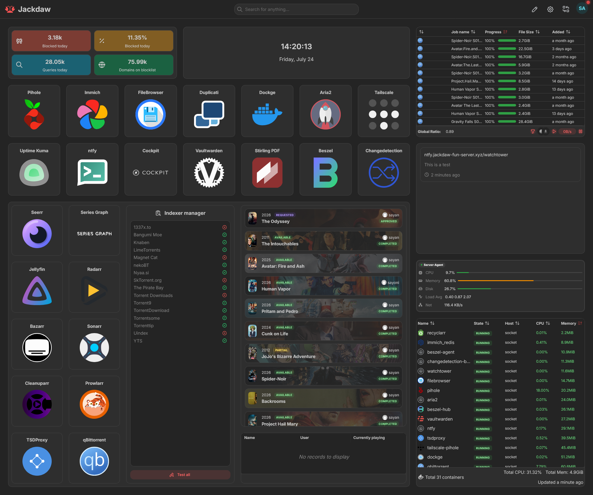
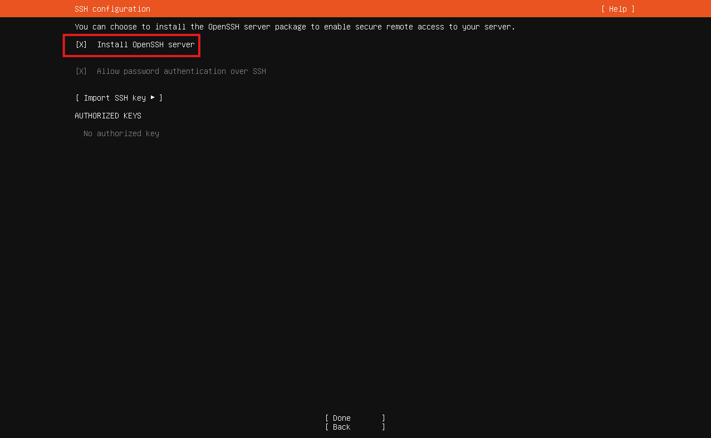

# Overview


This guide is a step-by-step walkthrough about turning your ancient PC (that just sits in a corner doing absolutely NOTHING) into your very own netflix, a cloud storage/NAS, image backup server, and many more with
a touch of *love*.

# Hardware Specifications
| Components | Specifications |
| --- | --- |
| Motherboard | Gigabyte H270-Gaming 3 |
| CPU | Intel® Core™ i3-7100 Processor @ 3.90 GHz |
| GPU/Integrated GPU | Intel® HD Graphics 630  |
| Memory | 8GB DDR4 2400 Mhz |
| Network | 150 Mbps ↓ / 170 Mbps ↑ |
| *Storage | *Seagate BarraCuda 1TB HDD |

> [!IMPORTANT]
> It is recommended to swap out HDD for a SSD to install the OS into. You can use that HDD as a cold storage!
>
> If you want hardware transcoding for Jellyin and Immich, you need a GPU either integrated or dedicated.

# Prequisite
- Internet Connection
- Flashdrive. 8GB or more
- Ubunter Server ISO
- *That Old PC/Laptop*
- Another PC/Laptop
- (Optional but Recommended) Custom Domain

> [!NOTE]
> This guide uses reverse proxy (Caddy) to access apps since every accessible port is bind to localhost and can only be reached via custom domains.
>
> You can do this without custom domains, more on that later.

# Setting up the Server
- Download [Ubuntu Server](https://ubuntu.com/download/server) ISO
- Flash the ISO into the flashdrive using your favourite tool. I personally like balenaEtcher.
- Plug that flashdrive into your _old PC_ and boot from it by pressing the boot menu key. Depending on your motherboard your boot menu key may be different! For me its **F12**.
- Install Ubuntu Server. Make sure to select "install **OpenSSH Server**".

  
  OR
  ```
  sudo apt update
  sudo apt install openssh-server -y
  sudo systemctl enable --now ssh
  ```
- After installation, give the server a static ip.
  
  Edit or make a file. For example, <kbd>/etc/netplan/static.yaml</kbd>
  ```
  network:
  version: 2
  renderer: networkd
  ethernets:
    enp6s0:
      dhcp4: false
      addresses: [192.168.1.200/24]
      routes:
        - to: default
          via: 192.168.1.1
      nameservers:
        addresses: [1.1.1.1, 1.0.0.1]
  ```
  Then `sudo netplan apply`.

- Install Tailscale and add the server into the tailnet

  ```
  curl -fsSL https://tailscale.com | sh
  sudo tailscale up
  ```
> [!NOTE]
> If you are planning to use **Pihole**, then you must disable DNS override by tailscale by using `sudo tailscale set --accept-dns=false`

- Install [Docker](https://docs.docker.com/engine/install/ubuntu/#install-using-the-repository). Also refer [here](https://docs.docker.com/engine/install/linux-postinstall/).
- Make a directory where you would want to keep all your containers. Lets say `~/docker-containers` for example.
  
  ```
  ~/docker-containers
    |
    ├── immich
    |   ├── compose.yaml
    |   ├── .env
    |   └── config/
    |
    ├── mediaserver
    |   ├── compose.yaml
    |   ├── .env
    |   └── config/
    |
    | ...
  
  ```
- (Optional) Unattended Upgrades
- (Optional but Recommended) Caddy. I use Caddy with porkbun module. [link](https://caddyserver.com/docs/modules/dns.providers.porkbun)

> [!TIP]
> If you do get a domain, make a wildcard subdomain pointing to the tailnet ip of the server. You can also have two seperate subdomains for tailnet and LAN. For example,<br>
>
> **foo.domain.tld** for **Tailnet**<br>
> **foo.local.domain.tld** for **LAN**

# Applications

- Dockge
- ntfy
- Filebrowser
TODO: add more to the list

TODO: make headings
### Dockge

### ntfy
